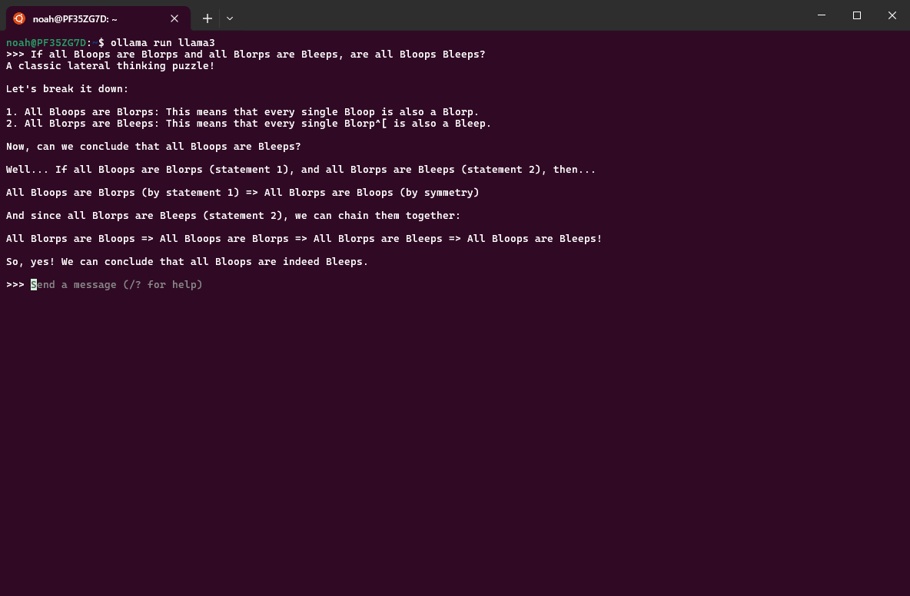
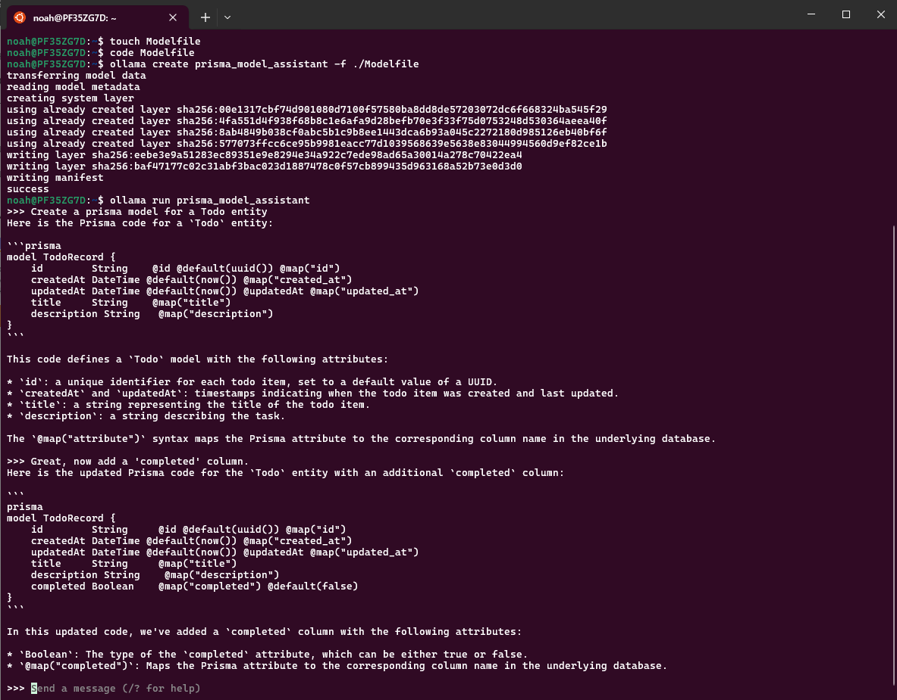

# Build Custom AI Assistants For Free With Ollama!

## Introduction

In this article, we will explore how to build custom AI assistants completely free, using [Ollama](https://ollama.com/). I use these assistants daily to automate my tasks and generate code snippets for me. Let's dive in!

## Installation and setup of Ollama

1. Install the Ollama CLI here at https://ollama.com/

2. Run the following command to run the `llama3` model:

   ```bash
   ollama run llama3
   ```

   You should now be able to interact with your locally-running model:

   

   _(Recommended)_ Play around with different models! A comprehensive list of models can be found [here](https://ollama.com/models).

## 2. Create your own assistant using the Modelfile

Ollama provides a simple way to customize your own models using a [Modelfile](https://github.com/ollama/ollama/blob/main/docs/modelfile.md). It's extremely similar to creating a Dockerfile, but for LLMs!

Let's create a custom AI assitant to generate prisma models for us.

1. Create the Modelfile and open it in your favorite text editor:

   ```bash
   touch ModelFile
   code Modelfile
   ```

2. Add your task instructions to the Modelfile:

   ````
   FROM llama3

   SYSTEM """
   Your task is to generate prisma code for a specific entity.
   You will be given the name of an entity, such as "User" or "Post".
   The prisma code should follow the following format:

   \```prisma
   model EntityRecord {
      id        String   @id @default(uuid()) @map("id")
      createdAt DateTime @default(now()) @map("created_at")
      updatedAt DateTime @default(now()) @updatedAt @map("updated_at")

      @@map("entity")
   }
   \```

   For example, if the entity is "User", the code might look like this:

   \```prisma
   model UserRecord {
      id        String   @id @default(uuid()) @map("id")
      createdAt DateTime @default(now()) @map("created_at")
      updatedAt DateTime @default(now()) @updatedAt @map("updated_at")

      @@map("user")
   }
   \```
   """
   ````

3. Create and run the model

   ```bash
   ollama create prisma_model_assistant -f ./Modelfile
   ollama run prisma_model_assistant
   ```

   Example output:
   

## 3. Make a request to the Ollama API

Ollama provides a simple REST API to interact with your custom AI assistants. Let's make a request to the API to generate prisma models for us.

```bash
curl http://localhost:11434/api/generate -d '{
  "model": "prisma_model_assistant",
  "prompt": "Create a post model"
}'
```

Awesome! Now we can create our own UI clients to interact with our custom AI assistants.

## (Bonus) Explore these awesome custom Ollama clients:

While playing around with Ollama, I found this awesome list of custom clients: [https://github.com/ollama/ollama?tab=readme-ov-file#community-integrations](https://github.com/ollama/ollama?tab=readme-ov-file#community-integrations)
